# Prototype
[Link to Figma prototype](https://www.figma.com/proto/wy3YgO5abDUNhz9CgITjYg/soundTrack-team-library?node-id=596%3A1137&scaling=scale-down&page-id=511%3A2&starting-point-node-id=511%3A7)

# App map
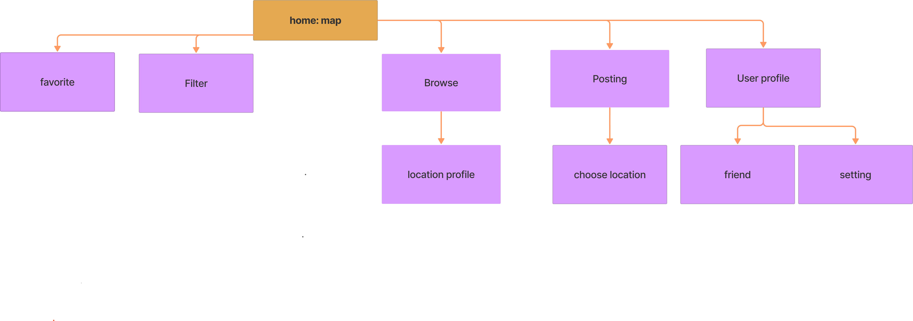

# Wireframes
## Login page
- User can log in

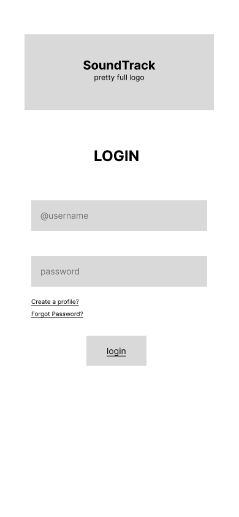

## Create Account page
- User can create account 

## Home page
- Shows home page and displays map with desired/current location
- User can search for a location with search bar 

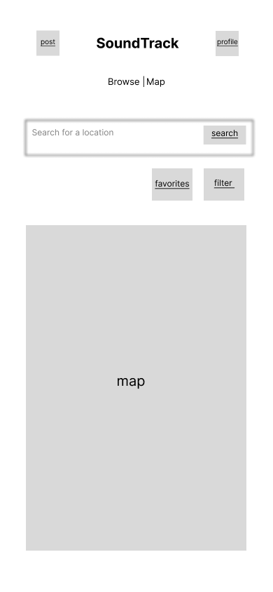

## Browse page
- Browsing page to see others' posts

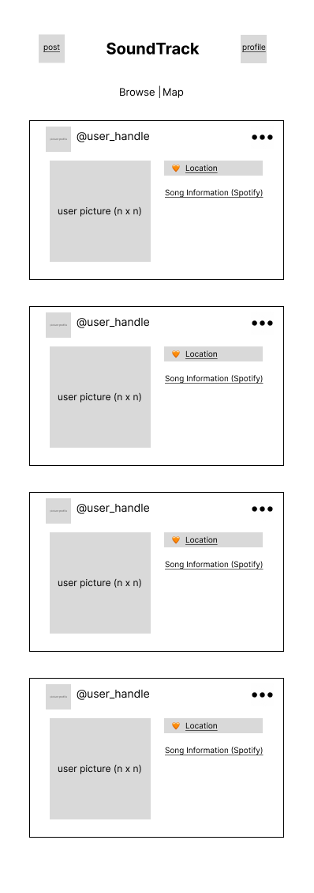

## Posting page 
- User take a photo, choose a song, pick a location and privacy setting to finish posting 
- User can change location with location pop up 

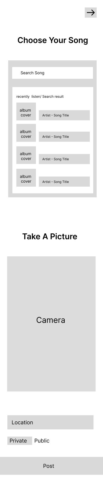
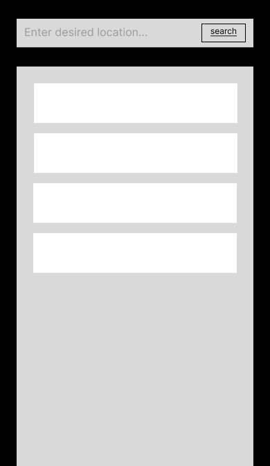

## User Profile page
- Shows user profile

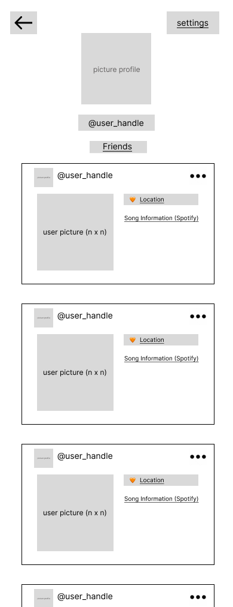
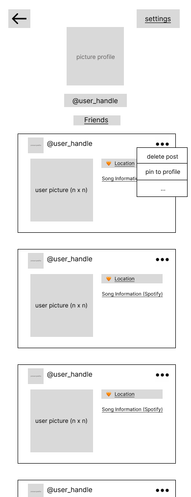

## Favorites
- Shows locations favorited by the user

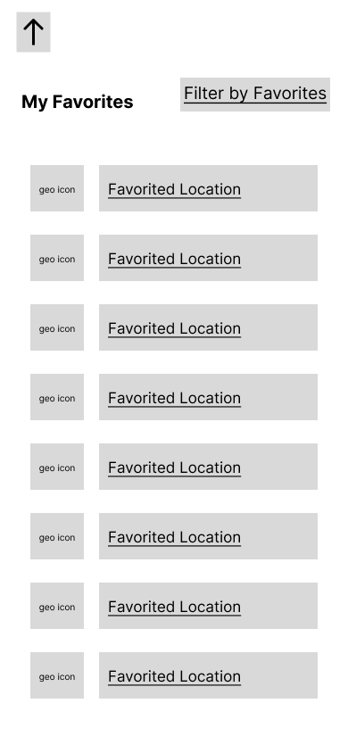

## Filter
- Shows filters for map/location browsing 

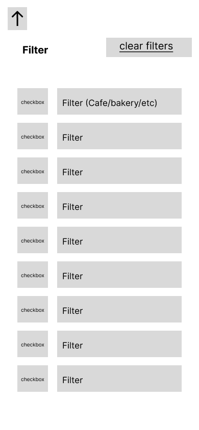

## Friends
- Shows friend list 

## Settings
- User can manage account setting such as changing public/private profile

## Location Profile
- User can view profile for a specific location 

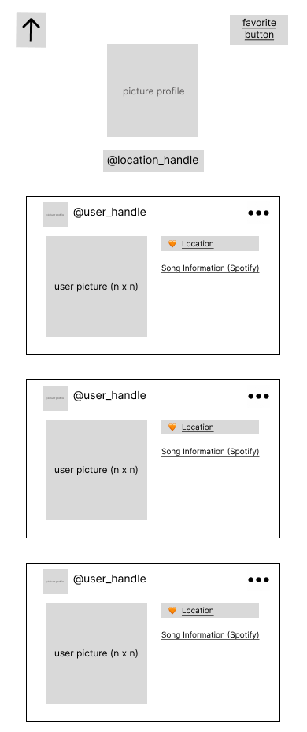

